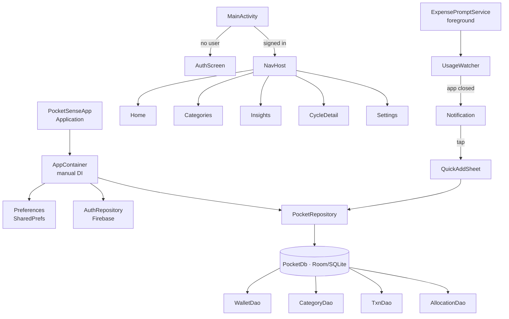
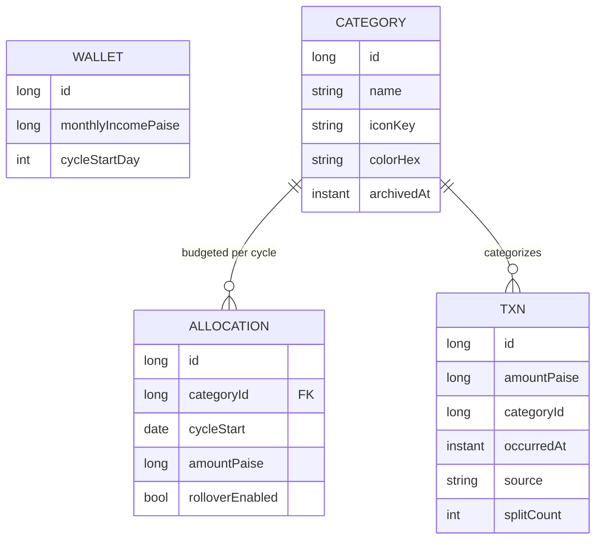

<div align="center">

# 💸 PocketSense

### A local-first budgeting app for India that *reminds you to log the expense you just made*.

<br/>


</div>

---

## ✨ What makes it different

Most expense trackers fail for one reason: **you forget to log the expense.** PocketSense fixes that.

> It quietly watches for when you **close a payments app** (Google Pay, PhonePe, Paytm, BHIM…) and then taps you on the shoulder: *"Did you spend in Google Pay? Tap to log it."* One tap, expense recorded.

All of your money data stays **100% on your device** — no servers, no tracking.

---

## 🎯 Features

| | |
|---|---|
| 🔔 **Auto-prompt watcher** | Detects when you leave a UPI/payments app and nudges you to log the spend |
| 👛 **Smart wallet** | Balance is *derived* from your transactions — always accurate |
| 🗂️ **Categories & budgets** | Per-category, per-cycle budgets with **rollover** of unspent amounts |
| 🚦 **Budget alerts** | Get notified at **80%** and **100%** of any category's budget |
| 📊 **Insights** | Last-7-days bar chart, month-wise totals, this-cycle-vs-last comparison |
| 🔍 **Cycle details** | Browse any past cycle and see the full **category-wise breakdown** |
| ✂️ **Bill splitting** | Split a bill N ways and log only *your* share |
| 📅 **Custom cycles** | Set your budget cycle to start on any day of the month (payday-friendly) |
| 📤 **CSV export** | Export every transaction and share it anywhere |
| 🌗 **Dark / Light / System** themes | |
| 🔐 **Firebase auth** | Email/password + Google Sign-In |

---

## 🖼️ App at a glance

```
┌─────────────┐   ┌─────────────┐   ┌─────────────┐   ┌─────────────┐
│    Home     │   │ Categories  │   │  Insights   │   │   Cycle     │
│             │   │             │   │             │   │  details    │
│ Wallet ₹    │   │ Food   80%  │   │ ▁▃▅▂▇▄▆     │   │ ← May → │   │
│ Safe today  │   │ Rent   45%  │   │ This vs last│   │ Food  ₹4,2k │
│ Budgets     │   │ Travel  …   │   │ By category │   │ Rent  ₹12k  │
│ Recent ▤▤▤  │   │ + New       │   │             │   │ Travel ₹900 │
└─────────────┘   └─────────────┘   └─────────────┘   └─────────────┘
```

---

## 🏗️ Architecture

Single-Activity, Compose-first, with a thin manual-DI container and a Room-backed repository.



### Data model



> 💡 **Money is always stored as `Long` paise** (₹1 = 100). Floating point is never used for currency. Wallet balance = `SUM(transactions.amountPaise)` where **positive = income, negative = expense**.

---

## 🧰 Tech stack

- **Language:** Kotlin 2.0.21
- **UI:** Jetpack Compose · Material 3 · Navigation-Compose
- **Local storage:** Room (SQLite) + KSP, schema v3 with migrations
- **Auth / Cloud:** Firebase Auth (Email + Google), Firebase Analytics
- **Async:** Kotlin Coroutines + Flow
- **Background:** `UsageStatsManager` + a `specialUse` foreground service
- **Build:** Gradle (Kotlin DSL) · AGP 8.7 · Java 17 · version catalog

---

## 📁 Project structure

```
app/src/main/java/app/pocketsense/
├── PocketSenseApp.kt          # Application + DI bootstrap
├── MainActivity.kt            # Single activity, NavHost, deep links
├── data/                      # Room entities, DAOs, repository, money & cycle math
│   ├── Models.kt  Daos.kt  PocketDb.kt  PocketRepository.kt
│   ├── Money.kt   BudgetMath.kt  Preferences.kt  AppContainer.kt
│   └── auth/AuthRepository.kt
├── service/                   # The "watcher" + notifications
│   ├── ExpensePromptService.kt  UsageWatcher.kt
│   ├── PaymentApps.kt           BudgetAlerts.kt
└── ui/                        # Compose screens
    ├── home/  categories/  insights/  quickadd/  settings/  auth/
    └── theme/  CategoryIcons.kt  Nav.kt
```

---

## 🚀 Build & run

### Option A — Android Studio (easiest)
1. Open the project in **Android Studio** (Koala / Ladybug+).
2. Let Gradle sync, then **Run ▶** on a device or emulator (min Android 8.0 / API 26).

### Option B — Command line (no IDE)
You need a **JDK 17+**, **Gradle 8.9**, and the **Android SDK**.

```bash
# build a debug APK
gradle assembleDebug

# install onto a connected device (USB debugging on)
adb install -r app/build/outputs/apk/debug/app-debug.apk
```

> ℹ️ This repo doesn't ship the `gradlew` wrapper. If you don't have Gradle on PATH, either open it once in Android Studio or run `gradle wrapper --gradle-version 8.9` to generate it.

> 🧠 **Low-RAM machines:** a full Kotlin + KSP build can OOM on ~5 GB RAM. If the Gradle daemon crashes, drop the heap in `gradle.properties`:
> ```properties
> org.gradle.jvmargs=-Xmx1280m -XX:MaxMetaspaceSize=384m
> org.gradle.parallel=false
> org.gradle.workers.max=1
> ```

### Firebase setup
The app needs `app/google-services.json` (already present for this project). For your own Firebase project, add Email/Password + Google providers and put your app's **SHA-1** in the Firebase console so Google Sign-In works.

---

## 🔐 Permissions & privacy

| Permission | Why |
|---|---|
| `PACKAGE_USAGE_STATS` | Detect when you leave a payments app (the core feature) |
| `POST_NOTIFICATIONS` | Show the "log this expense?" prompt and budget alerts |
| `FOREGROUND_SERVICE` (`specialUse`) | Keep the watcher running reliably |
| `INTERNET` | Firebase authentication only |

**Your spending data never leaves the device.** It lives in a private on-device database and is not synced to any server.

---

## ⚠️ Important: your data is local-only

Because everything is stored on-device with `android:allowBackup="false"` and **no cloud sync of transactions**, your data is **erased if you uninstall the app**. Use **Settings → Export to CSV** regularly to keep a copy. *(Cloud backup / sync is on the roadmap below.)*

---

## 🗺️ Roadmap / ideas

- [ ] **Cloud backup & restore** (Firestore sync per signed-in account) so an uninstall can't wipe your history
- [ ] **CSV / JSON import** to complement export
- [ ] Unit tests around the money, cycle, and rollover math
- [ ] Recurring transactions & income reminders
- [ ] Wire up the existing (currently unused) onboarding flow

---

## 📄 License

No license specified yet — add one (e.g. MIT) before publishing.

<div align="center">
<br/>
Made with ☕ and Kotlin · <i>spend mindfully</i>
</div>
